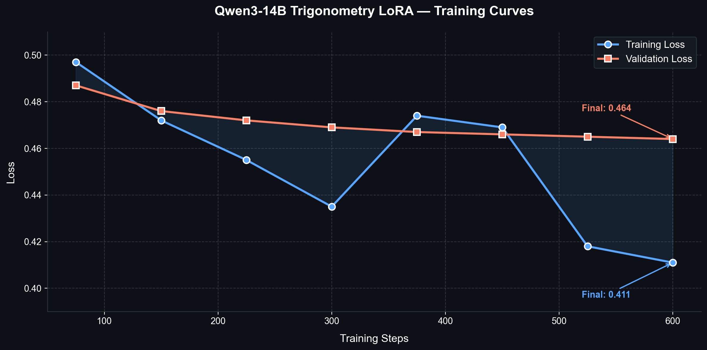

<h1 align="center">🔺 Qwen3-14B Trigonometry — LoRA Fine-Tuned</h1>

<p align="center">
  <em>A precision-tuned large language model for step-by-step trigonometry problem solving</em>
</p>

<p align="center">
  
  
  
  
</p>

<p align="center">
  <a href="#-quick-start"><strong>Quick Start</strong></a> •
  <a href="#-results"><strong>Results</strong></a> •
  <a href="#-comparison"><strong>Comparison</strong></a> •
  <a href="#-interactive-notebook"><strong>Colab Notebook</strong></a> •
  <a href="#-methodology"><strong>Methodology</strong></a>
</p>

---

## 📋 Project Overview

This repository contains a **LoRA fine-tuned Qwen3-14B model** specialized for solving trigonometry problems with clean, structured, step-by-step reasoning. The model was trained on a curated subset of high-quality mathematical problems and demonstrates significant improvements in response quality and usability over the base model.

### Key Highlights

| Metric | Value |
|--------|-------|
| 🏗️ **Base Model** | Qwen/Qwen3-14B (14.8B parameters) |
| 🎯 **Trainable Parameters** | 64M (0.43% of total) |
| 📊 **Training Samples** | 5,000 (from 25,204 curated problems) |
| 📉 **Final Validation Loss** | 0.464 |
| ⏱️ **Training Steps** | 625 (1 epoch) |
| 🏆 **Comparison Win Rate** | 5/5 vs base model |

---

## 🚀 Quick Start

### Option 1: Google Colab (Recommended)

The easiest way to try the model is through our interactive Colab notebook:

[](https://colab.research.google.com/github/ZenithGupta/Model-Training/blob/main/notebooks/inference_demo.ipynb)

### Option 2: Local Setup

```python
from unsloth import FastLanguageModel

# Load the fine-tuned model
model, tokenizer = FastLanguageModel.from_pretrained(
    model_name="path/to/qwen3-14b-trig-lora-v2",
    max_seq_length=2048,
    load_in_4bit=True,
)

FastLanguageModel.for_inference(model)

# Create a prompt
prompt = """<|im_start|>system
You are a trigonometry expert. Solve problems step-by-step with clear reasoning.<|im_end|>
<|im_start|>user
Find the exact value of sin(75°).<|im_end|>
<|im_start|>assistant
"""

inputs = tokenizer(prompt, return_tensors="pt").to("cuda")
outputs = model.generate(**inputs, max_new_tokens=2048, temperature=0.7)
print(tokenizer.decode(outputs[0], skip_special_tokens=True))
```

### Requirements

```
unsloth
torch>=2.0
transformers
peft
bitsandbytes
accelerate
```

---

## 📊 Results

### Training Metrics

The model was trained for **1 full epoch** (625 steps) with consistent loss reduction across training:

<div align="center">

| Step | Training Loss | Validation Loss | Δ Val Loss |
|:----:|:------------:|:---------------:|:----------:|
| 75   | 0.497        | 0.487           | —          |
| 150  | 0.472        | 0.476           | -0.011     |
| 225  | 0.455        | 0.472           | -0.004     |
| 300  | 0.435        | 0.469           | -0.003     |
| 375  | 0.474        | 0.467           | -0.002     |
| 450  | 0.469        | 0.466           | -0.001     |
| 525  | 0.418        | 0.465           | -0.001     |
| 600  | 0.411        | 0.464           | -0.001     |

</div>

<p align="center">
  
</p>

**Key Observations:**
- 📉 **Steady convergence** — Validation loss decreased consistently from 0.487 → 0.464
- ✅ **No overfitting** — Training and validation losses tracked closely throughout
- 🎯 **Optimal stopping** — Loss plateau suggests training duration was well-calibrated

---

## 🔍 Comparison: Fine-Tuned vs Base Model

Both models were tested under identical conditions (2048 max tokens, same prompt template) on 5 held-out trigonometry problems. The fine-tuned model won every comparison.

### Head-to-Head Summary

| Criterion | Fine-Tuned ✅ | Base Model ❌ |
|-----------|:------------:|:------------:|
| Produces visible answer | ✅ Yes | ❌ No (stuck in `<think>`) |
| Step-by-step format | ✅ Clean, numbered | ❌ N/A |
| Correct final answer | ✅ 5/5 | ❌ 0/5 (never outputs) |
| Usable within 2048 tokens | ✅ Always | ❌ Never |

### 📝 Example: Limit Problem

**Problem:** *Evaluate the limit involving trigonometric functions (expected answer: −50)*

<table>
<tr>
<th width="50%">🟢 Fine-Tuned Model</th>
<th width="50%">🔴 Base Model</th>
</tr>
<tr>
<td>

```
Step 1: Identify the limit structure...
Step 2: Apply L'Hôpital's rule...
Step 3: Simplify using trig identities...
Step 4: Evaluate the expression...

Final Answer: -50 ✓
```

</td>
<td>

```
<think>
Let me think about this problem...
I need to consider the approach...
Perhaps if I try...
[continues for 2048 tokens]
[NEVER produces an answer]
</think>
```

</td>
</tr>
</table>

> **Verdict:** The fine-tuned model delivers immediate, structured, correct solutions while the base model exhausts its token budget in internal reasoning without ever producing a user-visible answer.

---

## 🧪 Methodology

### Dataset Curation

```
NuminaMath-CoT (HuggingFace)
        │
        ▼
  Filter: Trigonometry-related problems
        │
        ▼
  25,204 high-quality problems
  Sources: olympiads, aops_forum, amc_aime, math
        │
        ▼
  ┌─────────┬────────────┬──────────┐
  │  Train  │ Validation │   Test   │
  │  5,000  │    500     │   500    │
  └─────────┴────────────┴──────────┘
```

### Training Configuration

| Parameter | Value |
|-----------|-------|
| **Quantization** | 4-bit (via Unsloth) |
| **LoRA Rank** | Default (Unsloth optimized) |
| **Learning Rate** | 1e-4 |
| **Batch Size** | 8 (1 × 8 gradient accumulation) |
| **Max Sequence Length** | 2048 |
| **Epochs** | 1 |
| **Total Steps** | 625 |
| **Optimizer** | AdamW (8-bit) |
| **LR Scheduler** | Linear warmup + decay |
| **Platform** | Google Colab Free Tier (T4 GPU, 15GB VRAM) |
| **Training Strategy** | Multi-session with checkpoint resuming |

### Model Architecture (LoRA)

```
Qwen3-14B (14.8B params) — Frozen
    │
    ├── Self-Attention
    │   ├── Q projection ← LoRA adapter (trainable)
    │   ├── K projection ← LoRA adapter (trainable)
    │   ├── V projection ← LoRA adapter (trainable)
    │   └── O projection ← LoRA adapter (trainable)
    │
    ├── MLP
    │   ├── Gate projection ← LoRA adapter (trainable)
    │   ├── Up projection   ← LoRA adapter (trainable)
    │   └── Down projection ← LoRA adapter (trainable)
    │
    └── Total trainable: 64M / 14.8B = 0.43%
```

---

## 📁 Repository Structure

```
qwen3-14b-trig-finetuned/
├── README.md                  # This file
├── LICENSE                    # MIT License
├── requirements.txt           # Python dependencies
├── .gitignore                 # Git ignore rules
├── notebooks/
│   └── inference_demo.ipynb   # Interactive Colab notebook
├── assets/
│   └── training_curves.png    # Loss curves visualization
├── results/
│   ├── training_log.md        # Detailed training metrics
│   └── comparison_report.md   # Base vs fine-tuned analysis
└── scripts/
    ├── inference.py           # Standalone inference script
    └── plot_training.py       # Generate training visualizations
```

---

## 📓 Interactive Notebook

The included [Colab notebook](notebooks/inference_demo.ipynb) provides:

1. **🔧 One-click setup** — Install dependencies and mount Google Drive
2. **🔺 Interactive mode** — Ask any trigonometry question and get step-by-step solutions
3. **📊 Side-by-side comparison** — See the fine-tuned model vs base model on the same problems
4. **📋 Pre-loaded examples** — Curated set of test problems showcasing model capabilities

---

## 🙏 Acknowledgments

- **[Qwen Team](https://huggingface.co/Qwen)** — For the Qwen3-14B base model
- **[Unsloth](https://github.com/unslothai/unsloth)** — For efficient 4-bit LoRA training
- **[NuminaMath](https://huggingface.co/datasets/AI-MO/NuminaMath-CoT)** — For the high-quality math dataset
- **[Google Colab](https://colab.research.google.com/)** — For accessible GPU compute

---

## 📄 License

This project is licensed under the MIT License — see [LICENSE](LICENSE) for details.

The base Qwen3-14B model is subject to its own [license terms](https://huggingface.co/Qwen/Qwen3-14B).

---

<p align="center">
  <sub>Built with 🔺 for precision mathematical reasoning</sub>
</p>
